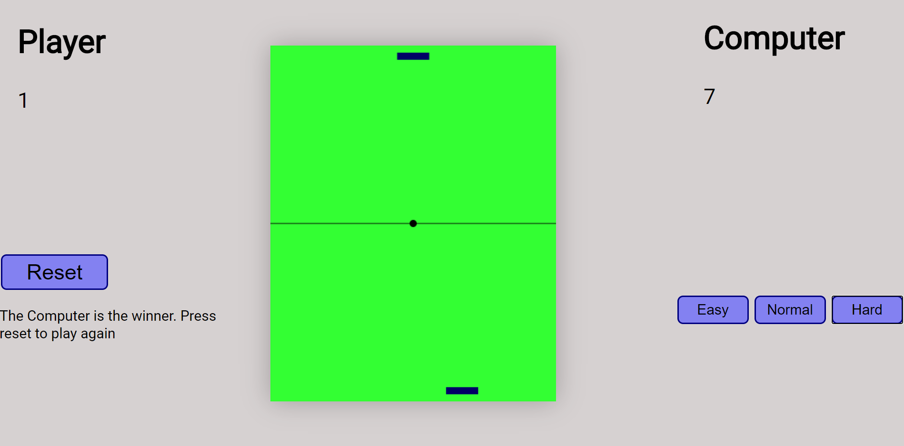

# Pong

## Intro

A responsive website creates the simple game of pong using only Html, CSS and JavaScript.

## For the user

Users can play against the Computer for a first to 7. If they find the CPU easy, they can easily increase the difficulty. But watch out. Hard mode is almost impossible to beat.

## Live Site

You can find the live app here at [Live Page](https://pong-umber.vercel.app/)

## Technical

This app was built using HTML5, CSS, JavaScript and jQuery. Sound function was added to give encouraging cheers or heartbreaking boos.
